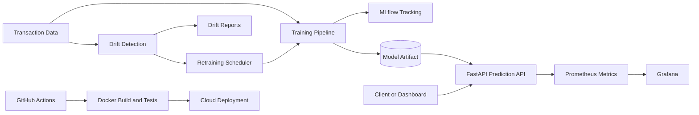

# Real-Time AI Prediction Platform

[](https://www.python.org/)
[](https://fastapi.tiangolo.com/)
[](https://streamlit.io/)
[](https://mlflow.org/)
[](https://www.docker.com/)
[](https://github.com/features/actions)

A production-style MLOps platform for real-time fraud prediction. The system trains a machine learning model, serves low-latency predictions through FastAPI, tracks experiments with MLflow, monitors prediction and drift signals, and supports automated retraining plus cloud deployment.

This project simulates how enterprise AI services are developed, shipped, monitored, and continuously improved.

## Platform Capabilities

| Capability | Implementation |
|---|---|
| Real-time predictions | FastAPI `/predict` endpoint |
| Model training pipeline | Scikit-learn pipeline with feature engineering |
| Automated retraining | Drift-triggered retraining scheduler |
| Experiment tracking | MLflow metrics, parameters, and model artifacts |
| Data drift monitoring | PSI and categorical distribution shift reports |
| Monitoring | Prometheus metrics, Grafana provisioning, Streamlit dashboard |
| Cloud deployment | Vercel API deployment and Streamlit dashboard deployment |
| Containerization | Dockerfile and Docker Compose stack |
| CI/CD | GitHub Actions validation, tests, Docker build, optional deployment hook |
| Documentation | Architecture diagram and operations runbook |

## Architecture



## Project Structure

```text
.github/workflows/ci-cd.yml        CI/CD pipeline
api/index.py                       Vercel FastAPI entrypoint
docs/architecture.md               Architecture documentation
docs/operations.md                 Operations runbook
monitoring/prometheus.yml          Prometheus scrape config
monitoring/grafana/                Grafana provisioning
models/current/                    Current trained model artifacts
src/realtime_ai_platform/api/      FastAPI prediction service
src/realtime_ai_platform/dashboard Streamlit monitoring dashboard
src/realtime_ai_platform/pipeline  Training, drift, retraining, scheduler
tests/                             Unit and API tests
Dockerfile                         Production API container
docker-compose.yml                 Local full-stack MLOps environment
pyproject.toml                     Vercel deployment dependencies
requirements.txt                   Full local and Docker dependencies
vercel.json                        Vercel project config
```

## Tech Stack

| Layer | Tools |
|---|---|
| API | FastAPI, Pydantic |
| ML | pandas, NumPy, scikit-learn, joblib |
| Tracking | MLflow |
| Monitoring | Prometheus, Grafana, Streamlit |
| Packaging | Docker, Docker Compose |
| Cloud | Vercel for API, Streamlit Community Cloud for dashboard |
| Automation | GitHub Actions |

## Prerequisites

- Python 3.11 for local development
- Docker Desktop for the full local MLOps stack
- Git and GitHub account
- Vercel account for API deployment
- Streamlit Community Cloud account for dashboard deployment

## Local Setup

Create and activate a virtual environment:

```powershell
py -3.11 -m venv .venv
.\.venv\Scripts\activate
python -m pip install --upgrade pip
pip install -r requirements.txt
copy .env.example .env
```

Update `.env` with your dataset path:

```env
DATA_PATH=C:\path\to\PS_20174392719_1491204439457_log.csv
MODEL_DIR=models/current
REPORTS_DIR=reports
MLFLOW_TRACKING_URI=file:mlruns
MLFLOW_EXPERIMENT_NAME=real-time-fraud-platform
TRAIN_SAMPLE_ROWS=250000
RETRAIN_INTERVAL_SECONDS=3600
DRIFT_THRESHOLD=0.2
FORCE_RETRAIN=false
```

## Train The Model

```powershell
python -m src.realtime_ai_platform.pipeline.train --data-path "C:\path\to\PS_20174392719_1491204439457_log.csv"
```

Training writes the active model to:

```text
models/current/model.joblib
models/current/metadata.json
```

The metadata file contains model metrics, creation time, feature schema, and the reference profile used for drift detection.

## Run The API Locally

```powershell
uvicorn src.realtime_ai_platform.api.main:app --reload
```

Open:

| Endpoint | URL |
|---|---|
| API home | http://localhost:8000 |
| Swagger docs | http://localhost:8000/docs |
| Health check | http://localhost:8000/health |
| Prometheus metrics | http://localhost:8000/metrics |

Example prediction request:

```powershell
Invoke-RestMethod `
  -Method Post `
  -Uri http://localhost:8000/predict `
  -ContentType "application/json" `
  -Body '{
    "step": 1,
    "type": "TRANSFER",
    "amount": 181.0,
    "oldbalanceOrg": 181.0,
    "newbalanceOrig": 0.0,
    "oldbalanceDest": 0.0,
    "newbalanceDest": 0.0
  }'
```

Example response:

```json
{
  "is_fraud": true,
  "fraud_probability": 0.91,
  "model_created_at": "2026-08-31T06:13:00+00:00"
}
```

## Run The Dashboard Locally

Start the API first, then run:

```powershell
streamlit run src/realtime_ai_platform/dashboard/app.py
```

Open:

```text
http://localhost:8501
```

If the dashboard is running outside Docker and your API is local, set:

```powershell
$env:API_URL = "http://localhost:8000"
streamlit run src/realtime_ai_platform/dashboard/app.py
```

## Run Drift Monitoring

```powershell
python -m src.realtime_ai_platform.pipeline.drift --data-path "C:\path\to\new_transactions.csv"
```

Generated reports:

```text
reports/drift_report.json
reports/drift_report.html
```

## Run Automated Retraining

Run one retraining check:

```powershell
python -m src.realtime_ai_platform.pipeline.retrain
```

Run the scheduler continuously:

```powershell
python -m src.realtime_ai_platform.pipeline.scheduler
```

The scheduler checks for drift at the configured interval and retrains automatically when drift exceeds `DRIFT_THRESHOLD` or when `FORCE_RETRAIN=true`.

## Run The Full MLOps Stack With Docker

```powershell
docker compose up --build
```

Services:

| Service | URL |
|---|---|
| FastAPI API | http://localhost:8000 |
| Streamlit dashboard | http://localhost:8501 |
| MLflow tracking server | http://localhost:5000 |
| Prometheus | http://localhost:9090 |
| Grafana | http://localhost:3000 |

Grafana default login:

```text
admin / admin
```

## Deploy The API To Vercel

The repository includes:

```text
api/index.py
vercel.json
pyproject.toml
.python-version
```

These files allow Vercel to deploy the FastAPI application from:

```text
src.realtime_ai_platform.api.main:app
```

Deployment steps:

1. Push the latest code to GitHub.
2. Create a new Vercel project from the GitHub repository.
3. Select the FastAPI preset.
4. Use root directory `./`.
5. Add environment variables.
6. Deploy.

Vercel environment variables:

```text
MODEL_DIR=models/current
MLFLOW_TRACKING_URI=file:mlruns
REPORTS_DIR=reports
MLFLOW_EXPERIMENT_NAME=real-time-fraud-platform
TRAIN_SAMPLE_ROWS=250000
RETRAIN_INTERVAL_SECONDS=3600
DRIFT_THRESHOLD=0.2
FORCE_RETRAIN=false
```

Leave `DATA_PATH` empty on Vercel. The deployed prediction API uses the committed model artifact in `models/current`.

After deployment, verify:

```text
https://your-vercel-app.vercel.app/
https://your-vercel-app.vercel.app/health
https://your-vercel-app.vercel.app/docs
```

## Deploy The Dashboard To Streamlit Community Cloud

Use Streamlit Community Cloud for the dashboard:

```text
Repository: Manesha03/Real-Time-AI-Prediction-Platform
Branch: main
Main file path: src/realtime_ai_platform/dashboard/app.py
Python version: 3.11 or 3.12
```

Add secrets in TOML format:

```toml
API_URL = "https://your-vercel-app.vercel.app"
MODEL_DIR = "models/current"
REPORTS_DIR = "reports"
MLFLOW_TRACKING_URI = "file:mlruns"
MLFLOW_EXPERIMENT_NAME = "real-time-fraud-platform"
```

The Streamlit app reads `API_URL` and sends prediction requests to the deployed FastAPI backend.

## CI/CD Pipeline

The GitHub Actions workflow in `.github/workflows/ci-cd.yml` runs on push and pull request to `main`.

Pipeline stages:

```text
Install dependencies
Compile source
Run tests
Build Docker image
Optionally publish image to GHCR
Optionally trigger cloud deployment
```

Run tests locally:

```powershell
.\.venv\Scripts\python.exe -m pytest -q
```

Expected result:

```text
3 passed
```

## Model And Monitoring Artifacts

| Artifact | Purpose |
|---|---|
| `models/current/model.joblib` | Active production model |
| `models/current/metadata.json` | Metrics, feature schema, reference drift profile |
| `reports/drift_report.json` | Latest drift result for automation and dashboard |
| `reports/drift_report.html` | Human-readable drift report |
| `mlruns/` | Local MLflow experiment history |

## Production Considerations

- Add authentication before exposing the prediction API publicly.
- Store model artifacts in object storage for multi-instance deployments.
- Use a managed MLflow backend for production experiment tracking.
- Replace CSV input with a database, stream, or feature store.
- Add model approval gates before automated production promotion.
- Configure alerts for drift, API latency, error rate, and prediction volume.

## Documentation

- [Architecture](docs/architecture.md)
- [Operations Runbook](docs/operations.md)
