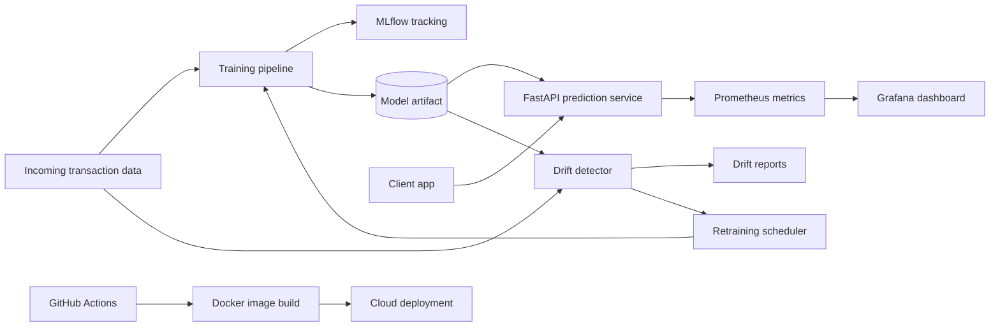

# Architecture

## Runtime Flow

1. The training job reads transaction data, builds fraud-detection features, trains a classifier, logs metrics to MLflow, and writes the active model to `models/current`.
2. The API loads the current model on each request and returns a fraud label plus probability.
3. Prometheus scrapes API latency and prediction counters from `/metrics`.
4. Drift checks compare incoming feature distributions with the training reference profile.
5. The scheduler retrains automatically when drift exceeds the configured threshold.
6. GitHub Actions validates tests and Docker builds before deployment.

## Production Notes

- Store model artifacts in object storage for multi-instance deployments.
- Use a managed database or feature store for production input data.
- Add authentication and request signing before exposing the API publicly.
- Replace deploy hooks with the target cloud provider's native promotion workflow.
